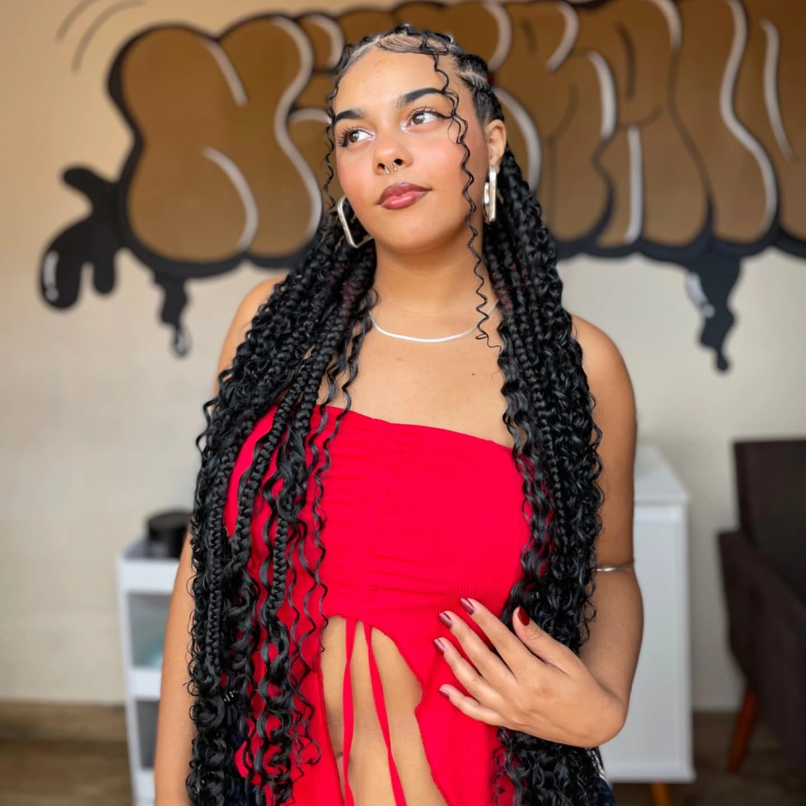

<div align="center">


<br>


</div>

---

<div align="center">

### 🌸 Um site criado para transformar visitantes em clientes.

</div>

---

## ✨ Sobre o projeto

O **Reliquias Braids** é um site demonstrativo desenvolvido para uma profissional especializada em tranças.

O projeto combina **design sofisticado, responsividade e funcionalidades reais**, criando uma experiência digital focada em apresentar os trabalhos e facilitar o agendamento.

<br>

<div align="center">

| 📅 Agendamento | 💬 WhatsApp | 📱 Responsivo |
|:---:|:---:|:---:|
| Calendário e horários | Contato direto | Mobile & Desktop |

| 💇 Serviços | 📋 Regras | ✨ Animações |
|:---:|:---:|:---:|
| Apresentação dos serviços | Informações do atendimento | Interface dinâmica |

</div>

---

# 📅 Sistema de Agendamento

<div align="center">

### Uma experiência simples para a cliente.

**👤 Dados pessoais**

⬇️

**💇 Escolha do serviço**

⬇️

**📆 Escolha da data**

⬇️

**🕐 Escolha do horário**

⬇️

**💬 Solicitação pelo WhatsApp**

</div>

<br>

O sistema permite que a cliente informe seus dados, escolha o serviço, selecione uma data e um horário disponível e envie a solicitação.

Os horários são consultados através da API de disponibilidade.

---

# 💬 WhatsApp

<div align="center">

### 📲 Atendimento sem complicação

</div>

O WhatsApp está integrado ao site para facilitar o contato com a profissional.

Além do botão flutuante, o formulário prepara automaticamente uma mensagem com as informações do agendamento.

---

# ✨ Experiência visual

<div align="center">



</div>

<br>

### 🎨 Características

```text
╭──────────────────────────────────────╮
│                                      │
│  ✨ Design sofisticado               │
│  📸 Foco visual nos trabalhos        │
│  📱 Layout responsivo                │
│  🎞️ Animações suaves                 │
│  💬 WhatsApp integrado               │
│  📅 Sistema de agendamento           │
│  ⚡ Interface dinâmica                │
│                                      │
╰──────────────────────────────────────╯
